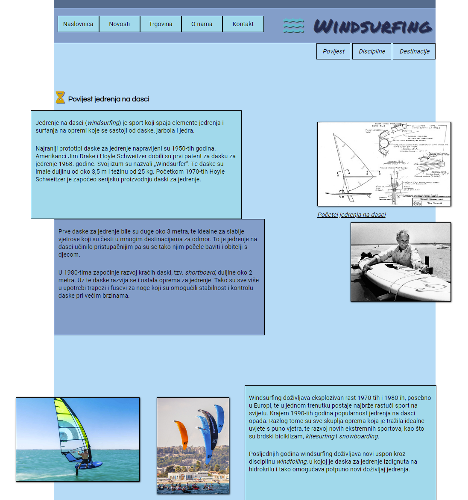

## Demo webpage for a class assignment

I created a simble webpage using HTML and CSS for our class assignment (*Introduction to web technologies*).

This is my first attempt at creating a webpage so it is far from perfect.

I have used positioning and float in CSS to create the layout. Before starting to design the page I made a short draft design of the page.

The main requirements of the assignment were given as follows:
- create a simple three page website with two mandatory pages, 'contact' and 'about us'. 
- use only layout techniques learned so far in the class (positioning and float).
- the choice of subject is free (I chose windsurfing, a sport I'm passionate about).

Although not required by the assignment, I tried to make the webpage as visualy as appealing as I could, considering my limited proficiency with web design.

